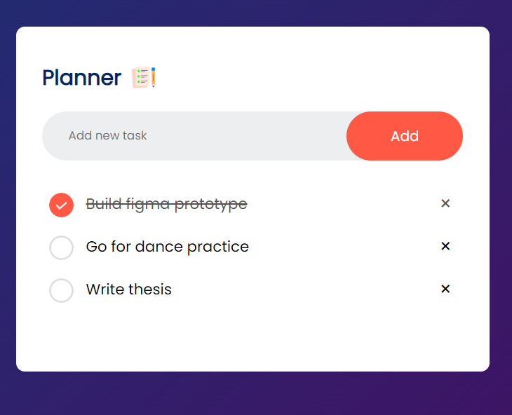

**To-Do List App README**

## Overview:
This To-Do List App is a simple web application designed to help users organize their tasks efficiently. It is built using HTML, CSS, and JavaScript to provide a straightforward and intuitive interface for managing tasks.

## Features:
1. **Add Tasks:** Allows users to add new tasks to their to-do list.
2. **Mark as Complete:** Enables users to mark tasks as complete once they are done.
3. **Delete Tasks:** Provides the option to delete tasks from the list.
4. **Local Storage:** Utilizes browser's local storage to persist tasks even after refreshing the page.

## Technologies Used:
- **HTML:** Provides the structure and layout of the web page.
- **CSS:** Styles the elements and enhances the visual appeal of the app.
- **JavaScript:** Implements the functionality, including adding, marking, and deleting tasks, as well as managing local storage.

## Getting Started:
To use the To-Do List App, follow these steps:

1. **Clone the Repository:** Clone this repository to your local machine using the following command:
   ```
   git clone https://github.com/yourusername/Simple_To-Do_list_App.git
   ```

2. **Navigate to the Directory:** Move into the directory containing the To-Do List App files:
   ```
   cd Simple_To-Do_list_App
   ```

3. **Open Index.html:** Open the `index.html` file in your preferred web browser.

## Usage:
1. **Add a Task:** Enter a task in the input field and press Enter or click the "Add" button to add it to the list.
2. **Mark as Complete:** Click on the checkbox next to a task to mark it as complete.
3. **Delete a Task:** Click on the delete icon (usually represented by a trash can) next to a task to remove it from the list.
4. **Manage Tasks:** Add, mark, or delete tasks as needed to keep your to-do list organized.
5. **Persistent Storage:** Tasks are saved in the browser's local storage, so they will persist even after refreshing the page or closing the browser.

## Preview:


## Support:
For any questions, issues, or feedback, please contact namatovutrismari@gmail.com.

## License:
This project is licensed under the [MIT License](LICENSE). Feel free to modify and distribute the code for personal or commercial use.

